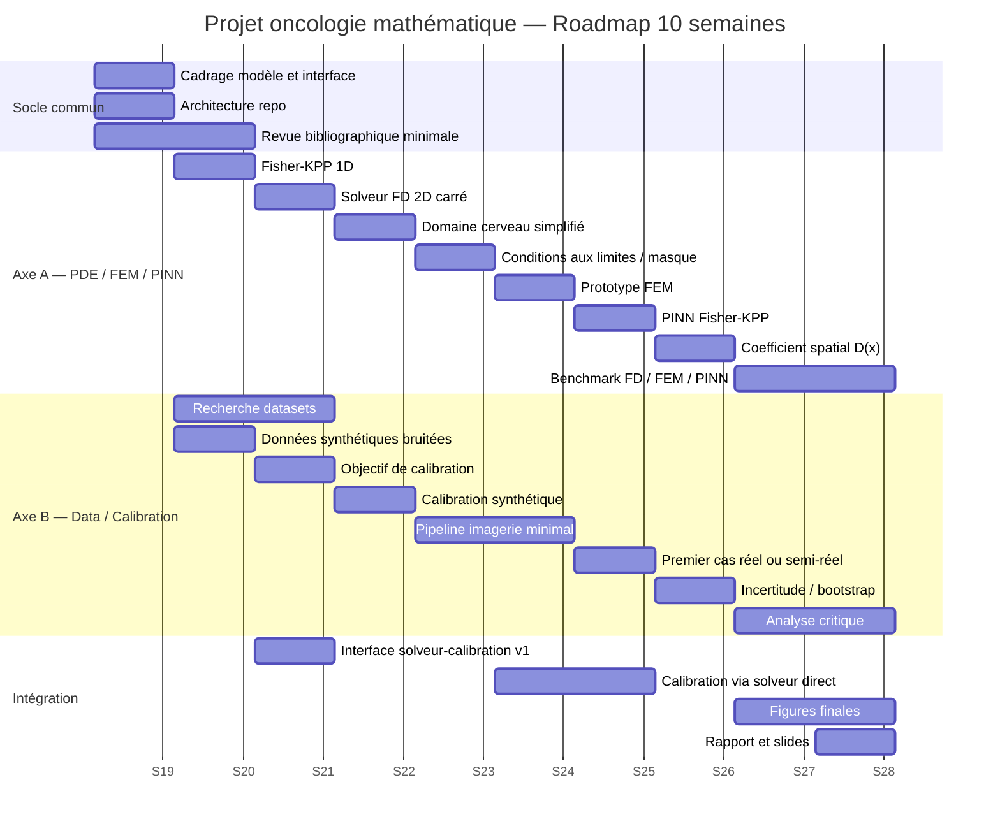
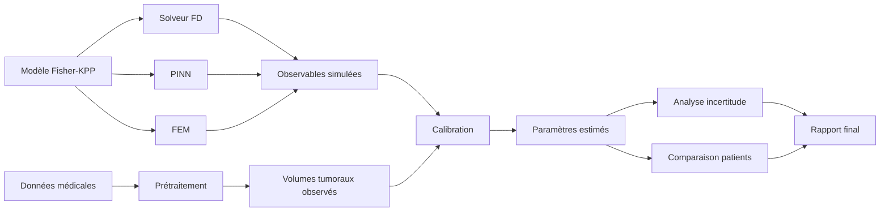
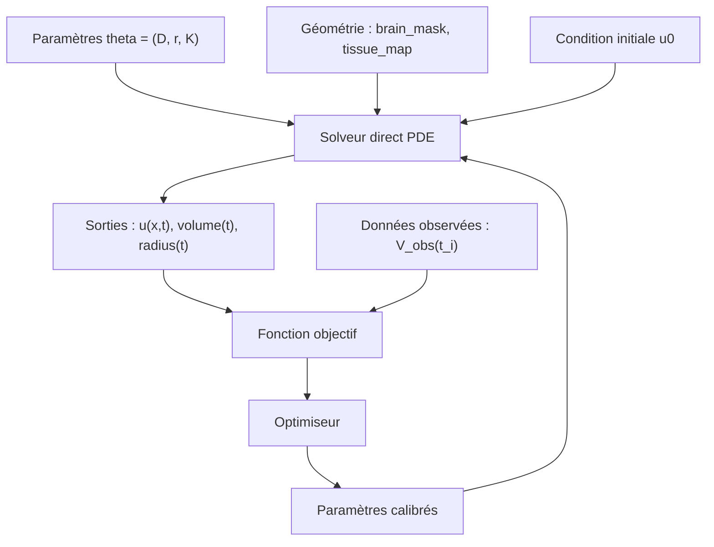
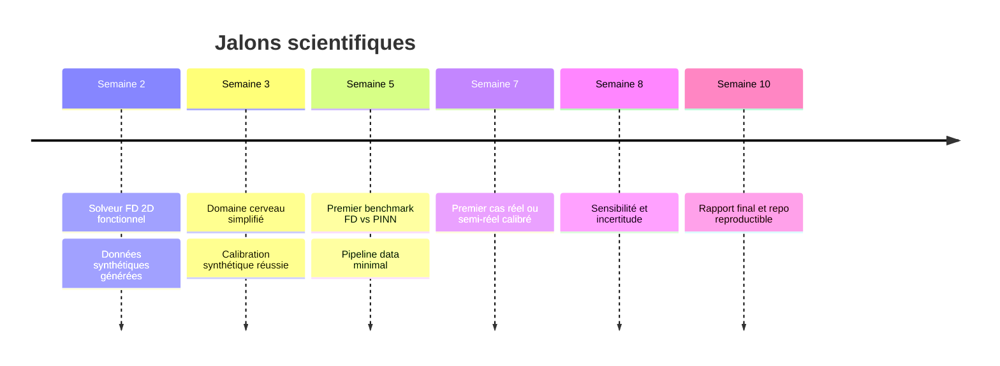
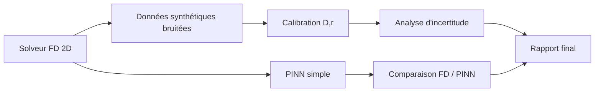

# Roadmap visuelle — Projet oncologie mathématique

## Vue d’ensemble

Objectif : organiser un projet à deux vitesses, avec deux axes réellement parallèles.

- **Axe A — PDE / FEM / PINN** : construire le solveur direct et la modélisation du domaine cérébral.
- **Axe B — Data / Calibration** : construire le pipeline données, calibration, incertitude et validation.

---

## Gantt général

---

| Semaine | Axe A — PDE / FEM / PINN | Axe B — Data / Calibration | Livrable commun |
|---|---|---|---|
| S1 | Modèle Fisher-KPP, Laplacien, conditions initiales | Recherche datasets, observables, littérature | `README.md`, interface solveur/calibration |
| S2 | Solveur FD 1D puis 2D carré | Générateur synthétique, bruit, première loss | Simulation + données synthétiques |
| S3 | Domaine cerveau simplifié avec masque | Calibration synthétique de `D`, `r`, `K` | Figure croissance + tableau paramètres |
| S4 | Conditions aux limites sur domaine masqué, FEM minimal | Optimisation robuste, données manquantes | Note FD vs FEM + calibration robuste |
| S5 | PINN Fisher-KPP | Pipeline imagerie minimal | Comparaison FD / PINN |
| S6 | Diffusion hétérogène `D(x)` | Dataset réel ou semi-réel choisi | Note dataset + figure hétérogénéité |
| S7 | API solveur stable, tests | Premier cas réel calibré | Données observées vs modèle |
| S8 | Benchmark FD / FEM / PINN | Incertitude, bootstrap, sensibilité | Figures erreur / temps / incertitude |
| S9 | Terme de traitement `-c(t)u` | Interprétation et limites cliniques | Figure traitement |
| S10 | Nettoyage code numérique | Nettoyage calibration et discussion | Rapport, slides, README final |

---

## Carte des dépendances

---

## Interface technique minimale

---

## Jalons de validation

---

## Version minimale viable

Si le projet doit être réduit, conserver seulement :

Cette version suffit à produire un projet cohérent : modèle direct, problème inverse, benchmark numérique, discussion critique.
